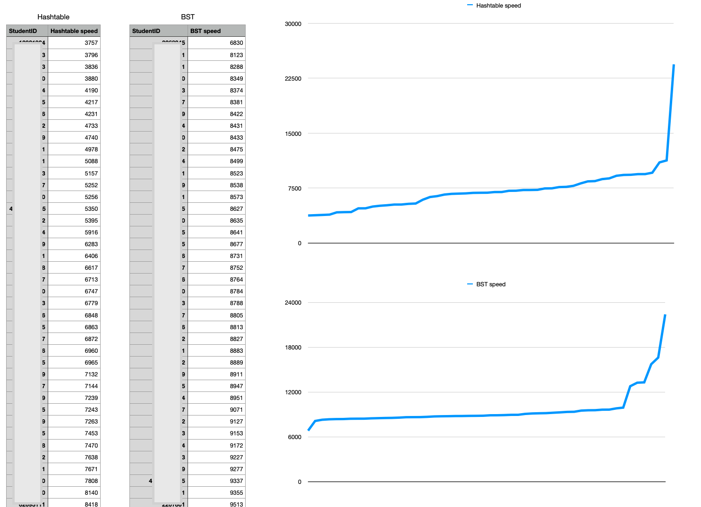

# SimplyTheBest

This command line tool gathers statistics about time performance of course projects implemented by students.

As the name of the tool implies, the idea is to find the best (fastest) implementations among all the student projects. Why this tool? My courses have 200-300 students attending, so testing, analysing the speeds and the best solutions manually is not something I want to do.

The tool assumes that:

* All student projects are located in subdirectories in a root directory. 
* Subdirectory name is the student's ID.
* Each student project contains a subtask in a subdirectory named `67-phonebook`.
* This subdirectory contains a file `compare.csv` having comma separated speed measurements (described below in Input and output files).

The tool: 

1. goes through all the student projects,
2. reads the measurement file `compare.csv` from each student's `67-phonebook` subdirectory,
3. finds the measurements for hashtable and binary search tree tests,
4. extracts the execution time for the largest test file `megalopolis.txt`,
5. saves the student id and execution times of the hashtable and binary search tree for the megalopolix test file into a `csv` file,
6. this `csv` file then can be opended in any spreadsheet app to analyse and create graphs comparing the execution times of the student projects.


## Input and output files

This is an example of the contents of an input file from a single student project from `<student-id>/67-phonebook/compare.csv`:

```console
testfile,bytes,elements,time (ms)
Binary search tree:
village.txt,4561,100,2
small-town.txt,44892,1000,6
town.txt,451617,10000,27
large-town.txt,2255053,50000,123
city.txt,4511688,100000,142
large-city.txt,22554540,500000,833
metropolis.txt,45107513,1000000,1819
capital.txt,90209834,2000000,4325
megalopolis.txt,227564229,5000000,12132
Hashtable:
village.txt,4561,100,1
small-town.txt,44892,1000,2
town.txt,451617,10000,59
large-town.txt,2255053,50000,80
city.txt,4511688,100000,124
large-city.txt,22554540,500000,558
metropolis.txt,45107513,1000000,1095
capital.txt,90209834,2000000,2435
megalopolis.txt,227564229,5000000,5253
```

And this is an example snippet from resulting output file when all student projects have been processed:

```console
StudentID,Hashtable speed,StudentID,BST speed
12345678,5252,12345678,9913
87654321,3584,87654321,9412
21346576,9413,21346576,9227
...
```
The student id column is repeated since it is then easier to cut and paste the hashtable and binary search tree columns to different sheets and sort and graph them separately by execution speed.

This is an example of how the produced `csv` file opened in Apple Numbers and the execution times are plotted (student id's redacted for  privacy'):



## Building and running

The tool uses the [Swift Argument Parser](https://github.com/apple/swift-argument-parser) component. The tool also uses some macOS 13 dependent APIs. 

Building from the command line:

```console
swift build
```

And running:

```console
swift run SimplyTheBest /Users/your-user-account/workspace/tira-2022-student/evaluation/ results
```
Where the parameters are:

1. the directory where the student projects are located,
2. the output file name (without extension) where the output data is stored.

Then just open the resulting output file in Apple Numbers, MS Excel or similar.

# License

MIT License
(c) Antti Juustila, 2023, All rights reserved.

